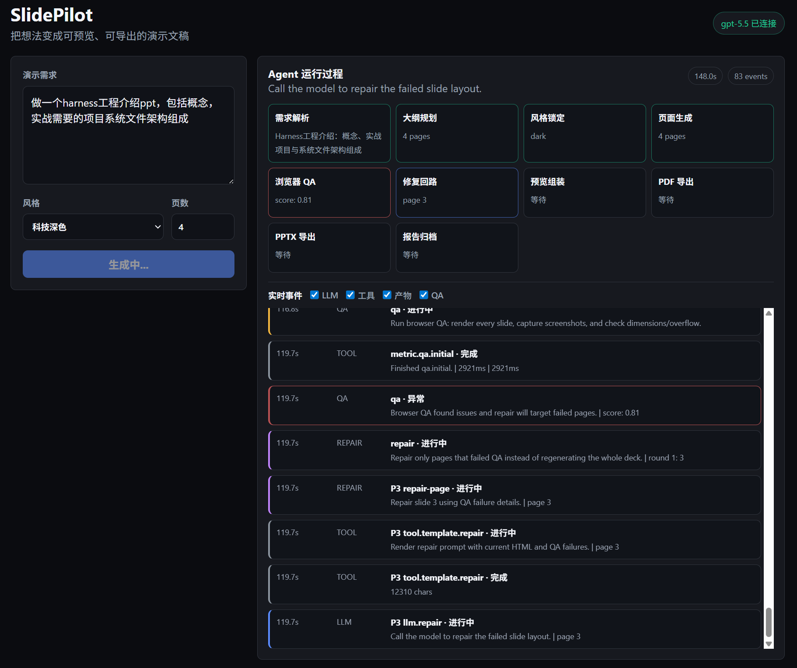
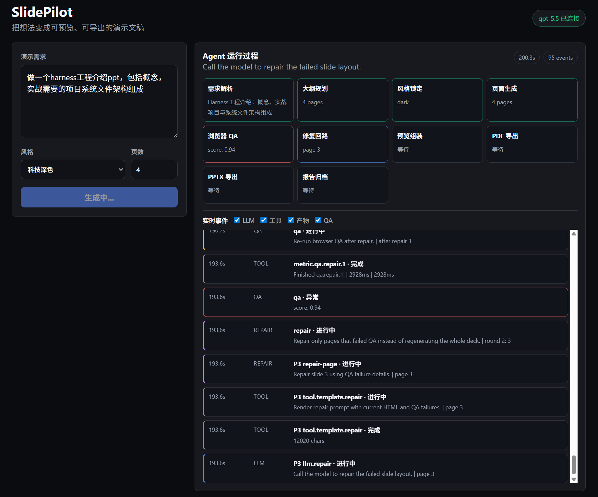

<div align="center">
  <h1>SlidePilot</h1>
  <p><strong>AI Presentation Agent — describe your idea, get a polished deck.</strong></p>
  <p>
    <a href="#quick-start"></a>
    <a href="LICENSE"></a>
    <a href="README.md"></a>
  </p>
  <p>
    
    
    
    
    
  </p>
</div>

---

**SlidePilot** is an open-source AI presentation agent that turns a topic, outline, or document into a professional HTML slide deck — with automatic browser-based QA, visual repair, manual single-slide revision, PDF export, and screenshot-based PPTX export. No PowerPoint, no code, no design skills required.

Unlike traditional PPT generators that stop at text generation, SlidePilot treats presentation creation as a **complete agent workflow**: understand → plan → style → render → inspect → repair → export.

## Why SlidePilot

| Pain Point | SlidePilot's Answer |
|---|---|
| Generated slides look generic | **Planning-first**: per-page content budget and layout contract before any HTML |
| No visual QA after generation | **Playwright + pixel QA**: automated overflow, blank ratio, edge cutoff, contrast, and screenshot checks |
| Style inconsistency across pages | **Global CSS lock**: one `style.json` → `global.css` applied to all pages |
| Can't iterate without code | **Web UI**: type your prompt, preview in browser, revise a single page, download PDF/PPTX |
| Locked to one LLM provider | **Any OpenAI-compatible API**: OpenAI, DeepSeek, Ollama, vLLM, etc. |
| Prompts buried in code | **Prompt Harness**: all LLM prompts as editable `.md` templates |
| Needs visual assets | **Multimodal image tool**: optional image generation/editing adapter with local asset storage |

## Demo

```bash
# Open http://127.0.0.1:4321, type:
"Make a 10-slide presentation about the future of AI Agents for undergraduate students, dark tech style"
```

```
✓ Requirement parsed
✓ Outline generated (10 pages)
✓ Style locked (tech-dark)
✓ Pages rendered (10/10)
✓ Browser QA passed (score: 1.0)
✓ PDF exported
✓ PPTX exported

Preview: http://127.0.0.1:4321/runs/{id}/preview.html
```

### Agent Trace




### Generated Deck

<p>
  
  
</p>
<p>
  
  
</p>

## Quick Start

```bash
git clone https://github.com/ranxi2001/SlidePilot
cd SlidePilot
npm install
npx playwright install chromium

# Start the web server (works without LLM config — uses mock data)
npm run dev
# → http://127.0.0.1:4321
```

### Enable LLM

```bash
cp .env.example .env
# Edit .env with your API credentials:
#   LLM_BASE_URL=https://api.openai.com/v1
#   LLM_API_KEY=sk-...
#   LLM_MODEL=gpt-4o
```

SlidePilot works with **any OpenAI-compatible API** — OpenAI, DeepSeek, Ollama, vLLM, Azure OpenAI, etc.

## Architecture

```
┌─────────────────────────────────────────────────────────────┐
│  Web UI (Browser)                                           │
│  Prompt → Progress → Preview (iframe) → Download PDF/PPTX   │
└──────────────────────────────┬──────────────────────────────┘
                               │ POST /api/create
┌──────────────────────────────▼──────────────────────────────┐
│  Agent Pipeline                                             │
│                                                             │
│  ┌─────────┐  ┌─────────┐  ┌──────────┐  ┌─────────────┐  │
│  │Requirement│→│ Outline │→│  Style   │→│ Per-Page Gen │  │
│  │  Parser  │  │ Planner │  │   Lock   │  │  (parallel) │  │
│  └─────────┘  └─────────┘  └──────────┘  └──────┬──────┘  │
│                                                   │         │
│                              ┌─────────┐  ┌──────▼──────┐  │
│                              │ Repair  │←─│ Browser QA  │  │
│                              │  Agent  │  │ (Playwright)│  │
│                              └────┬────┘  └─────────────┘  │
│                                   │                         │
│                    ┌──────────────▼──────────────┐          │
│                    │  Assemble + PDF/PPTX Export │          │
│                    └────────────────────────────-┘          │
└─────────────────────────────────────────────────────────────┘
                               │
┌──────────────────────────────▼──────────────────────────────┐
│  Artifacts (per run)                                        │
│  runs/{id}/                                                 │
│  ├── outline.json        — narrative structure              │
│  ├── style.json          — locked visual system             │
│  ├── global.css          — generated from style.json        │
│  ├── planning/*.json     — per-page content contract        │
│  ├── slides/*.html       — per-page HTML (1280×720)         │
│  ├── png/*.png           — per-page screenshots             │
│  ├── preview.html        — assembled deck with navigation   │
│  ├── deck.pdf            — print-ready export               │
│  ├── deck.pptx           — screenshot-based PPTX export     │
│  └── report.md           — QA summary                       │
└─────────────────────────────────────────────────────────────┘
```

## Core Design

### Per-Page HTML (1280×720)

Each slide is a **self-contained HTML file** with a fixed 1280×720 viewport — like PPTAgent and ppt-agent-skills. This enables:
- Independent QA and repair per page
- Parallel generation
- Individual screenshots
- Clean PDF page breaks

### Planning-First Rendering

Inspired by ppt-agent-skills' density contract system:

```
Outline → PagePlanning (JSON) → HTML
```

The LLM first outputs a structured **content plan** (layout, density, content budget, blocks), then generates HTML that must conform to it. This prevents "attention collapse" from trying to plan + design + code simultaneously.

### Prompt Harness

All LLM prompts live as **editable Markdown templates** in `src/prompts/templates/`:

```
requirement.md   — parse user intent
outline.md       — narrative structure
style.md         — visual system
page-planning.md — per-page content contract
page-html.md     — HTML generation
repair.md        — fix QA failures
revise.md        — apply user-requested single-page edits
```

Variables are injected via `{{VAR}}` syntax. Missing variables throw errors. No prompt logic in application code.

### Pixel-Level QA

Playwright checks every page automatically:

| Check | What it detects |
|-------|-----------------|
| DIM | Viewport exceeds 1280×720 |
| OVERFLOW | Content elements exceed slide bounds |
| BLANK | Page has < 5 characters of text |
| CONSOLE | JavaScript errors |
| SCREENSHOT | Captures PNG for visual review |
| PNG-SIZE | Screenshot file too small or corrupt |
| BLANK-PIXEL | Excessive single-color/blank-like area |
| EDGE-CUT | Foreground pixels touching page edges |
| LOW-CONTRAST | Weak luminance separation in content regions |
| VERTICAL-TEXT | Narrow vertical foreground bands that may indicate stacked text |

Failed pages enter a **repair loop** (max 3 rounds) where the LLM fixes issues based on QA feedback.

Generated decks can also be manually revised from the Web UI. The endpoint `POST /api/runs/:runId/slides/:pageIndex/revise` updates one slide, reruns QA, rebuilds `preview.html`, and regenerates PDF/PPTX artifacts.

### Multimodal Image Tool

SlidePilot includes an optional OpenAI-compatible image adapter for generation and image editing. It defaults to the same `LLM_BASE_URL`/`LLM_API_KEY` and can be overridden with `IMAGE_BASE_URL`, `IMAGE_API_KEY`, and `IMAGE_MODEL`.

- `POST /api/images/generate` creates PNG assets under `runs/{id}/assets/`.
- `POST /api/images/edit` accepts multipart image uploads and stores edited PNG assets.
- During Agent generation, visual blocks can call the image tool automatically when the image API is configured, then render the generated local asset in the slide.

## Tech Stack

| Layer | Technology |
|-------|-----------|
| Runtime | Node.js 20+ |
| Language | TypeScript |
| Web Server | Hono |
| Schema Validation | Zod |
| Browser Automation | Playwright |
| LLM Interface | OpenAI SDK (any compatible API) |
| Image Tool | OpenAI-compatible images API |
| PDF Export | Playwright Print |
| PPTX Export | PptxGenJS (full-slide PNG export) |

## Project Structure

```
SlidePilot/
├── src/
│   ├── server.ts                 # Web server entry
│   ├── routes.ts                 # API endpoints
│   ├── schemas.ts                # Zod schemas (all data models)
│   ├── llm/
│   │   └── client.ts             # OpenAI-compatible LLM client
│   ├── multimodal/
│   │   └── image-client.ts        # Image generation/editing adapter
│   ├── prompts/
│   │   ├── harness.ts            # Template engine
│   │   └── templates/*.md        # Editable prompt templates
│   ├── agent/
│   │   ├── orchestrator.ts       # Pipeline coordinator
│   │   └── reviser.ts            # Single-slide manual revision
│   ├── renderer/
│   │   ├── style-generator.ts    # StyleSpec → global.css
│   │   ├── page-renderer.ts      # PagePlanning → HTML
│   │   └── assembler.ts          # Pages → preview deck
│   ├── qa/
│   │   └── browser-qa.ts         # Playwright visual checks
│   ├── export/
│   │   ├── pdf.ts                # Per-page PDF merge
│   │   └── pptx.ts               # Screenshot-based PPTX export
│   ├── storage/
│   │   └── run-store.ts          # Artifact persistence
│   └── report/
│       └── generator.ts          # Markdown report
├── public/                       # Web UI (zero-build)
├── tests/
├── docs/PRD.md
├── .env.example                  # LLM config template
├── package.json
└── tsconfig.json
```

## Comparison

| Feature | PPTAgent | ppt-master | ppt-agent-skills | **SlidePilot** |
|---------|----------|------------|------------------|----------------|
| Output format | PPTX | PPTX | HTML→PPTX | **HTML/PDF + HTML→PPTX** |
| Target user | Researchers | Office users | Developers | **Non-technical** |
| PPTX export | Yes | Yes | Yes | **Yes (screenshot-based)** |
| Editable PowerPoint objects | Yes | Yes | Partial | **No (image-based PPTX today)** |
| Per-page HTML | Yes | No | Yes | **Yes** |
| Planning-first | Partial | No | Yes (JSON contract) | **Yes (JSON contract)** |
| Browser QA | Vision LLM | No | Pixel analysis | **Pixel + Playwright** |
| Layout repair loop | Yes | Limited | Skill-dependent | **QA-targeted failed-page repair** |
| Real-time agent trace | Limited | No | No | **Built-in NDJSON progress stream** |
| Prompt templates | Jinja2 | N/A | Harness + playbooks | **Markdown harness** |
| Web UI | Gradio | N/A | N/A | **Built-in** |
| API surface | Script/Gradio | Script | Skill runtime | **Hono REST + stream API** |
| Test modes | Project-specific | Project-specific | Skill-specific | **Harness + API + mock E2E** |
| LLM provider | Any | OpenAI | Any | **Any** |
| Language | Python | Python | Python (skill) | **TypeScript** |

SlidePilot currently optimizes for browser-verifiable HTML decks rather than native PowerPoint editing. The current path is `HTML→PNG→PPTX`: it embeds QA-verified screenshots for reliable visual fidelity. The longer-term path is a hybrid `HTML/SVG→editable PPTX` exporter that maps simple text/cards to editable PPTX shapes and keeps complex visuals as rendered images.

## Referenced Projects

SlidePilot's architecture and roadmap were informed by these open-source PPT/slide projects:

| Project | What SlidePilot learned from it |
|---------|---------------------------------|
| [PPTAgent](https://github.com/icip-cas/PPTAgent) | Multi-agent presentation generation, review loops, and PPTX-focused delivery |
| [ppt-master](https://github.com/hugohe3/ppt-master) | Native editable PPTX direction via SVG → DrawingML conversion, template discipline, and spec locks |
| [ppt-agent-skills](https://github.com/sunbigfly/ppt-agent-skills) | Planning contracts, density budgets, visual QA, and dual PNG/SVG PPTX export ideas |
| [guizang-ppt-skill](https://github.com/op7418/guizang-ppt-skill) | Skill-oriented PPT generation workflow and prompt packaging |
| [GordenPPTSkill](https://github.com/GordenSun/GordenPPTSkill) | PPT skill conventions and structured presentation generation patterns |
| [html-ppt-skill](https://github.com/lewislulu/html-ppt-skill) | HTML-first slide generation and browser-previewable presentation output |
| [frontend-slides](https://github.com/zarazhangrui/frontend-slides) | Frontend slide composition and visual template references |
| [beautiful-html-templates](https://github.com/zarazhangrui/beautiful-html-templates) | HTML visual style/template references for richer slide layouts |

Local reference clones live under `.packs/ppt-skills/` and are intentionally ignored by git. The current implementation has absorbed the shared patterns that fit SlidePilot's architecture: planning contracts, per-page HTML, browser/pixel QA, screenshot-based PPTX export, and template-driven layout/style ideas. The remaining native editable-object PPTX direction is tracked separately in the roadmap.

## Roadmap

### Done

- [x] Per-page HTML rendering with fixed 1280×720 slide files.
- [x] Planning-first generation: requirement → outline → page planning JSON → HTML.
- [x] Prompt Harness with editable Markdown templates.
- [x] Global style system from `style.json` to `global.css`.
- [x] Web UI with streaming Agent progress, tool events, artifacts, QA, and repair status.
- [x] Browser QA with Playwright checks for load, dimensions, overflow, safe area, overlap, text, and console errors.
- [x] Pixel-level screenshot QA for blank ratio, edge cutoff, low contrast, screenshot file size, and suspected vertical text.
- [x] QA-targeted repair loop for failed pages.
- [x] Per-page preview assembly plus PDF export.
- [x] Screenshot-based PPTX export for reliable visual fidelity.
- [x] Single-slide manual revision endpoint and Web UI controls.
- [x] Multimodal image generation/editing adapter with local asset storage.
- [x] Web UI screenshot gallery, QA issue viewer, image assets, and revision history panel.
- [x] Generated-image policy config and per-run image limit.
- [x] `GET /api/runs/:runId` run detail API.
- [x] API, mock pipeline, stream, revision, and image-adapter tests.
- [x] Reference project review and local clones under `.packs/ppt-skills/`.

### P0: Current Stabilization

- [ ] Add visual asset selection policy: when to generate, when to reuse, and when to avoid images.
- [ ] Add whole-deck revision entry points, not just single-slide revision.
- [ ] Add failed-page quick navigation and QA filters.
- [ ] Add run artifact cleanup policy and disk quota hints.
- [ ] Add a Web UI preview entry for image-only runs.

### P1: Deck Quality

- [ ] Absorb more layout patterns from `frontend-slides` and `beautiful-html-templates`.
- [ ] Expand theme library and page structure templates.
- [ ] Add image search and embedding for factual/product/location visuals.
- [ ] Add multi-turn natural language iterative editing across the whole deck.
- [ ] Add template/style playbooks for business, education, research, and product decks.

### P2: PowerPoint Direction

- [ ] Build hybrid editable-object PPTX export for simple titles, body text, cards, and shapes.
- [ ] Keep complex visuals as rendered images while mapping simple DOM/SVG to PPTX shapes.
- [ ] Add PPTX template ingestion and brand style extraction.
- [ ] Add PPTX round-trip QA: export → inspect slide count/images/text → report.

### P3: Delivery

- [ ] Docker packaging.
- [ ] CI with mock tests, build, and Playwright smoke checks.
- [ ] Demo video and screenshot gallery.
- [ ] Public examples for HTML, PDF, PPTX, and image-assisted decks.

## Contributing

Contributions welcome! See [docs/PRD.md](docs/PRD.md) for the full product requirements document.

Frontend UX and UI iteration details are tracked in [docs/FRONTEND-PRD.md](docs/FRONTEND-PRD.md).

## License

[MIT](LICENSE)
