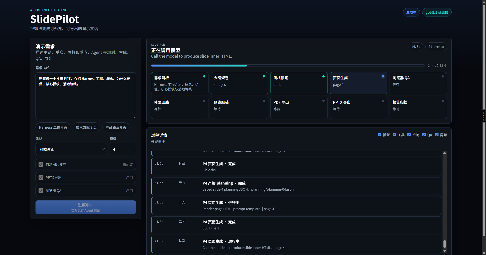
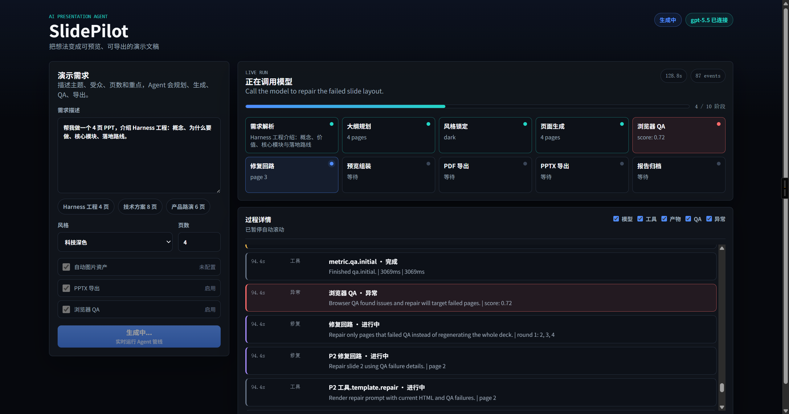
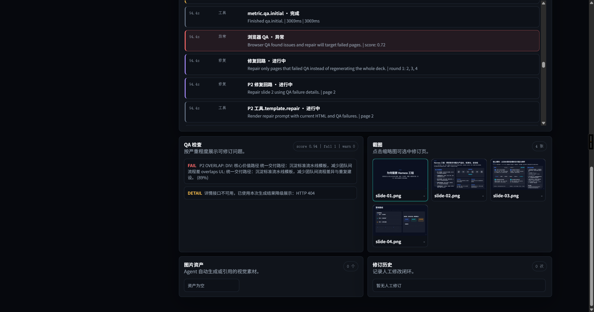
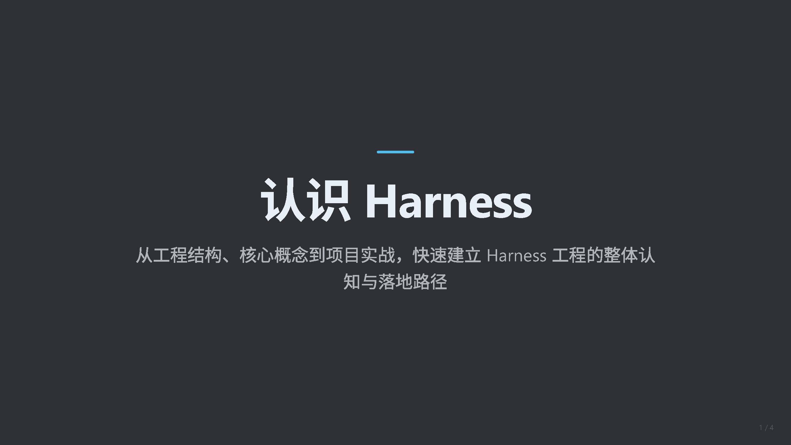
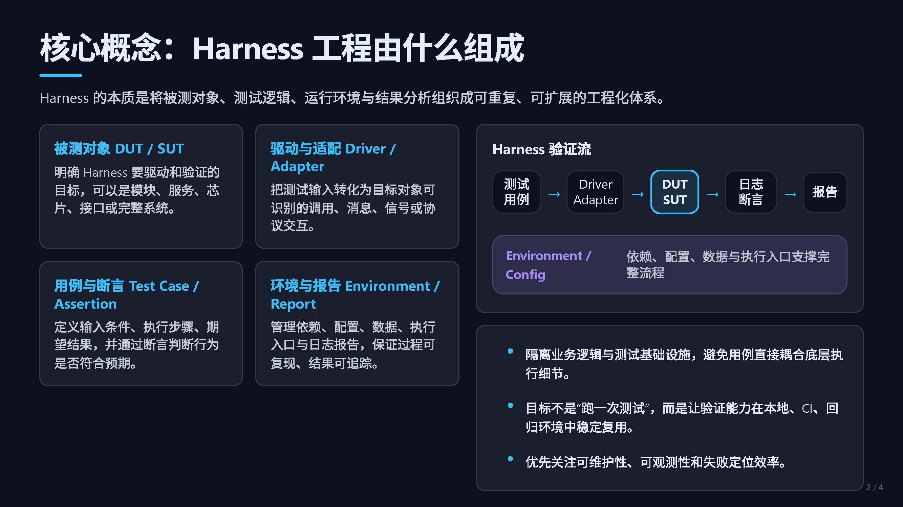
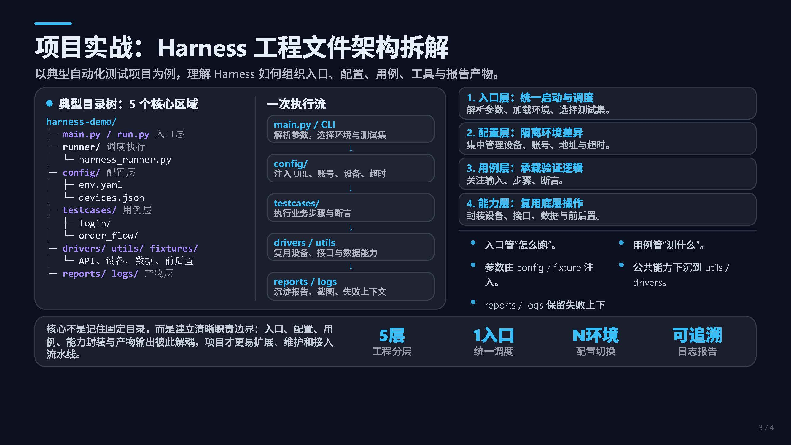
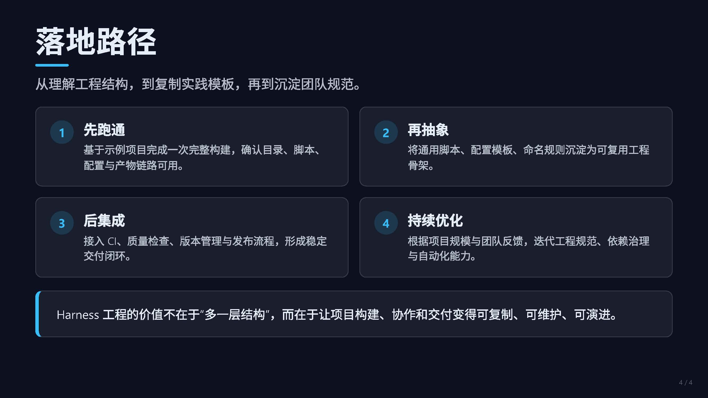

<div align="center">
  <h1>SlidePilot</h1>
  <p><strong>AI 演示文稿智能体 — 描述想法，获得专业 Deck</strong></p>
  <p>
    <a href="#快速开始"></a>
    <a href="LICENSE"></a>
    <a href="README-EN.md"></a>
  </p>
  <p>
    
    
    
    
    
  </p>
</div>

---

**SlidePilot** 是一个开源 AI 演示文稿智能体，能将主题、大纲或文档自动转化为专业 HTML 演示文稿——包含浏览器自动验收、像素级 QA、视觉修复、单页人工修订、多模态图片工具、PDF 导出和截图式 PPTX 导出。无需 PowerPoint，无需写代码，无需设计能力。

与传统 PPT 生成工具只做"文本填充"不同，SlidePilot 将演示文稿创建视为**完整的 Agent 工作流**：理解需求 → 规划叙事 → 锁定风格 → 渲染页面 → 自动验收 → 修复缺陷 → 导出交付。

## 为什么选择 SlidePilot

| 痛点 | SlidePilot 的解法 |
|------|------------------|
| 生成的页面千篇一律 | **规划先行**：每页有结构化内容预算和布局合同，再生成 HTML |
| 生成后没有视觉检查 | **Playwright + 像素 QA**：检测溢出、空白比例、边缘裁切、低对比度、截图异常 |
| 各页风格不统一 | **全局样式锁**：一份 `style.json` → `global.css`，全 deck 统一 |
| 不会写代码就无法迭代 | **浏览器 UI**：输入需求、预览结果、查看 QA、单页修订、下载 PDF/PPTX，零门槛 |
| 绑定单一 LLM 服务商 | **任意 OpenAI 兼容 API**：OpenAI、DeepSeek、Ollama、vLLM 等 |
| Prompt 写死在代码里 | **Prompt Harness**：所有提示词为可编辑的 `.md` 模板文件 |
| 缺少视觉资产 | **多模态图片工具**：可选生图/以图改图适配器，生成资产保存到本地 run 目录 |

## 效果演示

```bash
# 打开 http://127.0.0.1:4321，输入：
"帮我做一个 10 页 PPT，主题是 AI Agent 的发展趋势，面向本科生，科技暗色风格"
```

```
✓ 需求解析完成
✓ 叙事大纲生成（10 页）
✓ 风格锁定（tech-dark）
✓ 页面渲染完成（10/10）
✓ 浏览器 QA 通过（score: 1.0）
✓ PDF 导出成功
✓ PPTX 导出成功

预览: http://127.0.0.1:4321/runs/{id}/preview.html
```

### Agent 工作台

<p>实时展示模型调用、工具执行、QA、修复回路、截图与单页修订，不展示私有思维链。</p>





### 生成效果

<p>
  
  
</p>
<p>
  
  
</p>

## 快速开始

```bash
git clone https://github.com/ranxi2001/SlidePilot
cd SlidePilot
npm install
npx playwright install chromium

# 启动服务（不配置 LLM 也能跑，使用 mock 数据）
npm run dev
# → http://127.0.0.1:4321
```

### 接入大模型

```bash
cp .env.example .env
# 编辑 .env 填入你的 API 信息：
#   LLM_BASE_URL=https://api.openai.com/v1
#   LLM_API_KEY=sk-...
#   LLM_MODEL=gpt-4o
```

支持**任意 OpenAI 兼容 API** — OpenAI、DeepSeek、Ollama、vLLM、Azure OpenAI 等均可直接使用。

## 系统架构

```
┌─────────────────────────────────────────────────────────────┐
│  浏览器 (Web UI)                                             │
│  输入需求 → 实时进度 → 预览 (iframe) → 下载 PDF/PPTX          │
└──────────────────────────────┬──────────────────────────────┘
                               │ POST /api/create
┌──────────────────────────────▼──────────────────────────────┐
│  Agent 流水线                                                │
│                                                             │
│  ┌─────────┐  ┌─────────┐  ┌──────────┐  ┌─────────────┐  │
│  │ 需求解析 │→│ 大纲规划 │→│ 风格锁定 │→│ 逐页生成    │  │
│  └─────────┘  └─────────┘  └──────────┘  └──────┬──────┘  │
│                                                   │         │
│                              ┌─────────┐  ┌──────▼──────┐  │
│                              │  修复   │←─│ 浏览器 QA   │  │
│                              │  Agent  │  │(Playwright) │  │
│                              └────┬────┘  └─────────────┘  │
│                                   │                         │
│                    ┌──────────────▼──────────────┐          │
│                    │   组装预览 + PDF/PPTX 导出    │          │
│                    └─────────────────────────────┘          │
└─────────────────────────────────────────────────────────────┘
                               │
┌──────────────────────────────▼──────────────────────────────┐
│  产物（每次运行）                                             │
│  runs/{id}/                                                 │
│  ├── outline.json        — 叙事结构                          │
│  ├── style.json          — 锁定的视觉系统                     │
│  ├── global.css          — 由 style.json 生成                │
│  ├── planning/*.json     — 每页内容合同                       │
│  ├── slides/*.html       — 每页独立 HTML（1280×720）          │
│  ├── png/*.png           — 每页截图                          │
│  ├── preview.html        — 组装后的演示 deck                  │
│  ├── deck.pdf            — 可打印 PDF                        │
│  ├── deck.pptx           — 截图式 PPTX                        │
│  └── report.md           — QA 报告                           │
└─────────────────────────────────────────────────────────────┘
```

## 核心设计

### 每页独立 HTML（1280×720）

每张幻灯片是一个**独立的 HTML 文件**，固定 1280×720 视口——与 PPTAgent、ppt-agent-skills 一致。这使得：
- 每页独立 QA、独立修复
- 可并行生成
- 逐页截图
- PDF 分页干净

### 规划先行渲染

借鉴 ppt-agent-skills 的密度合同系统：

```
大纲 → PagePlanning (JSON) → HTML
```

LLM 先输出结构化的**内容规划**（布局、密度、内容预算、区块分配），然后再基于规划生成 HTML。避免"一步到位"导致的注意力塌陷。

### Prompt Harness（提示词引擎）

所有 LLM 提示词存放在 `src/prompts/templates/` 下的 **Markdown 模板**中：

```
requirement.md   — 需求解析
outline.md       — 叙事大纲
style.md         — 视觉系统
page-planning.md — 单页内容合同
page-html.md     — HTML 生成
repair.md        — QA 修复
revise.md        — 单页人工修订
```

通过 `{{VAR}}` 语法注入变量，缺失变量直接报错。应用代码中不含任何 prompt 逻辑。

### 像素级 QA

Playwright 自动检查每一页：

| 检查项 | 检测内容 |
|--------|---------|
| DIM | 视口是否超过 1280×720 |
| OVERFLOW | 内容元素是否超出幻灯片边界 |
| BLANK | 页面文字是否少于 5 个字符 |
| CONSOLE | 是否有 JavaScript 错误 |
| SCREENSHOT | 截图保存供人工复查 |
| PNG-SIZE | 截图文件是否过小或损坏 |
| BLANK-PIXEL | 是否存在过高单色/空白区域 |
| EDGE-CUT | 前景像素是否贴边，疑似裁切 |
| LOW-CONTRAST | 内容区域亮度分离是否过弱 |
| VERTICAL-TEXT | 是否存在疑似竖排/堆叠文字 |

QA 失败的页面进入**修复循环**（最多 3 轮），LLM 根据 QA 反馈修复问题。

生成后的 deck 也可以在 Web UI 中做单页人工修订。接口 `POST /api/runs/:runId/slides/:pageIndex/revise` 会更新指定页面、重新 QA、重建 `preview.html`，并重新导出 PDF/PPTX。

### 多模态图片工具

SlidePilot 内置可选 OpenAI-compatible 图片适配器，支持图片生成和以图改图。默认复用 `LLM_BASE_URL` / `LLM_API_KEY`，也可以用 `IMAGE_BASE_URL`、`IMAGE_API_KEY`、`IMAGE_MODEL` 单独配置。

- `POST /api/images/generate`：生成 PNG，保存到 `runs/{id}/assets/`。
- `POST /api/images/edit`：接收 multipart 图片上传，保存编辑后的 PNG。
- Agent 生成页面时，如果页面规划中有 visual block 且图片工具开启，会自动调用图片工具并把本地图片资产渲染进页面。
- 可通过 `IMAGE_AUTO_GENERATE` 和 `IMAGE_MAX_IMAGES_PER_RUN` 控制自动生图与单次 run 图片数量。

## 技术栈

| 层级 | 技术 |
|------|-----|
| 运行时 | Node.js 20+ |
| 语言 | TypeScript |
| Web 服务 | Hono |
| Schema 校验 | Zod |
| 浏览器自动化 | Playwright |
| LLM 接口 | OpenAI SDK（任意兼容 API） |
| 图片工具 | OpenAI-compatible Images API |
| PDF 导出 | Playwright Print |
| PPTX 导出 | PptxGenJS（整页 PNG 嵌入） |

## 项目结构

```
SlidePilot/
├── src/
│   ├── server.ts                 # Web 服务入口
│   ├── routes.ts                 # API 路由
│   ├── schemas.ts                # Zod 数据模型
│   ├── llm/
│   │   └── client.ts             # LLM 客户端（OpenAI 兼容）
│   ├── multimodal/
│   │   └── image-client.ts        # 图片生成/以图改图适配器
│   ├── prompts/
│   │   ├── harness.ts            # 模板引擎
│   │   └── templates/*.md        # 可编辑 prompt 模板
│   ├── agent/
│   │   ├── orchestrator.ts       # 流水线协调器
│   │   └── reviser.ts            # 单页人工修订
│   ├── renderer/
│   │   ├── style-generator.ts    # StyleSpec → global.css
│   │   ├── page-renderer.ts      # PagePlanning → HTML
│   │   └── assembler.ts          # 多页 → 预览 deck
│   ├── qa/
│   │   └── browser-qa.ts         # Playwright 视觉检查
│   ├── export/
│   │   ├── pdf.ts                # 逐页 PDF 合并
│   │   └── pptx.ts               # 截图式 PPTX 导出
│   ├── storage/
│   │   └── run-store.ts          # 产物持久化
│   └── report/
│       └── generator.ts          # Markdown 报告
├── public/                       # Web UI（零构建）
├── tests/
├── docs/PRD.md
├── .env.example                  # LLM 配置模板
├── package.json
└── tsconfig.json
```

## 对比

| 特性 | PPTAgent | ppt-master | ppt-agent-skills | **SlidePilot** |
|------|----------|------------|------------------|----------------|
| 输出格式 | PPTX | PPTX | HTML→PPTX | **HTML/PDF + HTML→PPTX** |
| 目标用户 | 研究者 | 办公用户 | 开发者 | **非技术用户** |
| PPTX 导出 | 是 | 是 | 是 | **是（截图式）** |
| PowerPoint 可编辑对象 | 是 | 是 | 部分 | **暂无（当前 PPTX 为图片嵌入）** |
| 每页独立 HTML | 是 | 否 | 是 | **是** |
| 规划先行 | 部分 | 否 | 是（JSON 合同） | **是（JSON 合同）** |
| 浏览器 QA | Vision LLM | 无 | 像素分析 | **像素 + Playwright** |
| 布局修复回路 | 是 | 有限 | 依赖 Skill | **按 QA 失败页定向修复** |
| Token 消耗倾向 | 高（多 Agent + 视觉审查） | 低到中（PPTX 结构生成） | 中到高（逐页 HTML + Skill 提示） | **中到高（规划 + 逐页生成；修复只重跑失败页以控成本）** |
| 实时 Agent 过程 | 有限 | 无 | 无 | **内置 NDJSON 进度流** |
| Prompt 模板化 | Jinja2 | 无 | Harness + Playbook | **Markdown harness** |
| Web UI | Gradio | 无 | 无 | **内置** |
| API 能力 | 脚本/Gradio | 脚本 | Skill Runtime | **Hono REST + 流式 API** |
| 测试模式 | 项目自带 | 项目自带 | Skill 自带 | **Harness + API + Mock E2E** |
| LLM 服务商 | 任意 | OpenAI | 任意 | **任意** |
| 开发语言 | Python | Python | Python (Skill) | **TypeScript** |

Token 消耗为相对倾向，实际取决于页数、模型上下文、是否启用视觉/图片能力、QA 失败页数量和修复轮次。SlidePilot 的主要消耗来自规划与逐页 HTML 生成，但修复阶段只重跑失败页，避免整套 deck 反复再生成。

SlidePilot 当前优先做“浏览器可验收的 HTML 演示文稿”，而不是原生 PowerPoint 编辑。当前路线是 `HTML→PNG→PPTX`：嵌入 QA 验收后的逐页截图，视觉还原稳定；更长期的路线是混合 `HTML/SVG→可编辑 PPTX` 导出：简单标题、正文、卡片转成可编辑 PPTX shape，复杂视觉区域保留为渲染图片。

## 参考项目

SlidePilot 的架构和路线参考了这些开源 PPT/Slides 项目：

| 项目 | 对 SlidePilot 的参考价值 |
|------|--------------------------|
| [PPTAgent](https://github.com/icip-cas/PPTAgent) | 多 Agent 演示文稿生成、审查回路、PPTX 交付思路 |
| [ppt-master](https://github.com/hugohe3/ppt-master) | SVG → DrawingML 的原生可编辑 PPTX 路线、模板纪律、spec lock |
| [ppt-agent-skills](https://github.com/sunbigfly/ppt-agent-skills) | planning 合同、密度预算、视觉 QA、PNG/SVG 双 PPTX 导出思路 |
| [guizang-ppt-skill](https://github.com/op7418/guizang-ppt-skill) | Skill 化 PPT 生成工作流和 prompt 包装方式 |
| [GordenPPTSkill](https://github.com/GordenSun/GordenPPTSkill) | PPT Skill 约定和结构化演示生成模式 |
| [html-ppt-skill](https://github.com/lewislulu/html-ppt-skill) | HTML-first slide 生成和浏览器可预览输出 |
| [frontend-slides](https://github.com/zarazhangrui/frontend-slides) | 前端幻灯片组合与视觉模板参考 |
| [beautiful-html-templates](https://github.com/zarazhangrui/beautiful-html-templates) | HTML 视觉样式和模板参考 |

## 路线图

### 已完成

- [x] 每页独立 HTML 渲染（固定 1280×720）。
- [x] 规划先行生成链路：需求 → 大纲 → 单页规划 JSON → HTML。
- [x] Prompt Harness：提示词全部放在可编辑 Markdown 模板中。
- [x] 全局样式系统：`style.json` → `global.css`。
- [x] Web UI 实时展示 Agent 进度、工具调用、产物、QA、修复状态。
- [x] Playwright 浏览器 QA：加载、尺寸、溢出、安全区、重叠、文本、控制台错误。
- [x] 像素级截图 QA：空白比例、边缘裁切、低对比度、截图文件过小、疑似竖排文字。
- [x] 针对 QA 失败页的自动修复回路。
- [x] 多页预览组装与 PDF 导出。
- [x] 截图式 PPTX 导出，优先保证视觉一致性。
- [x] 单页人工修订 API 与 Web UI 控件。
- [x] 多模态图片生成/以图改图适配器，生成资产本地保存。
- [x] Web UI 截图画廊、QA 问题查看器、图片资产和修订历史面板。
- [x] 生成图片策略配置和单 run 图片数量限制。
- [x] `GET /api/runs/:runId` run 详情接口。
- [x] API、mock pipeline、stream、revision、image adapter 测试。
- [x] 参考项目阅读与本地 clone，目录为 `.packs/ppt-skills/`。

### P0：当前稳定化

- [ ] 增加视觉资产策略：什么时候生图、什么时候复用、什么时候不用图。
- [ ] 增加整套 deck 的修订入口，而不只是单页修订。
- [ ] 增加失败页快速跳转和 QA 过滤器。
- [ ] 增加 run 产物清理策略和磁盘配额提示。
- [ ] 为 image-only run 增加 Web UI 预览入口。

### P1：Deck 质量

- [ ] 继续吸收 `frontend-slides` 和 `beautiful-html-templates` 的布局结构。
- [ ] 扩展主题库和页面结构模板。
- [ ] 增加图片搜索与事实型视觉素材嵌入。
- [ ] 支持整套 deck 的多轮自然语言迭代修改。
- [ ] 增加商务、教育、研究、产品类 deck 的模板 playbook。

### P2：PowerPoint 路线

- [ ] 做混合可编辑对象 PPTX：标题、正文、卡片、简单 shape 转为 PPTX 对象。
- [ ] 复杂视觉保留为渲染图片，简单 DOM/SVG 映射为 PPTX shape。
- [ ] 支持 PPTX 模板导入和品牌样式抽取。
- [ ] 增加 PPTX round-trip QA：导出 → 检查页数/图片/文本 → 报告。

### P3：交付

- [ ] Docker 打包。
- [ ] CI：mock 测试、构建、Playwright smoke check。
- [ ] 演示视频和截图画廊。
- [ ] 公开 HTML、PDF、PPTX、图片辅助 deck 示例。

## 目标用户

- **学生** — 课程汇报、答辩、组会分享
- **老师** — 课件、讲义、公开课
- **产品经理** — 需求评审、路线图、竞品分析
- **创业者** — Pitch Deck、商业计划书
- **研究人员** — 论文分享、技术报告
- **开发者** — 技术分享、项目介绍

## 贡献

欢迎贡献！完整产品需求文档见 [docs/PRD.md](docs/PRD.md)。

前端体验与 UI 迭代文档见 [docs/FRONTEND-PRD.md](docs/FRONTEND-PRD.md)。

## 许可证

[MIT](LICENSE)
